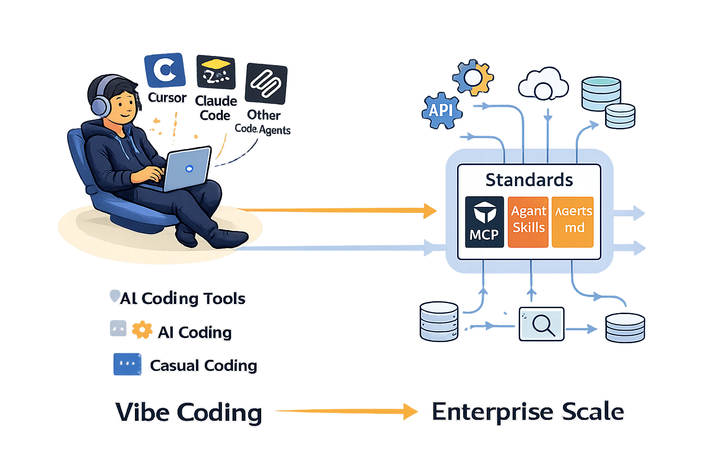
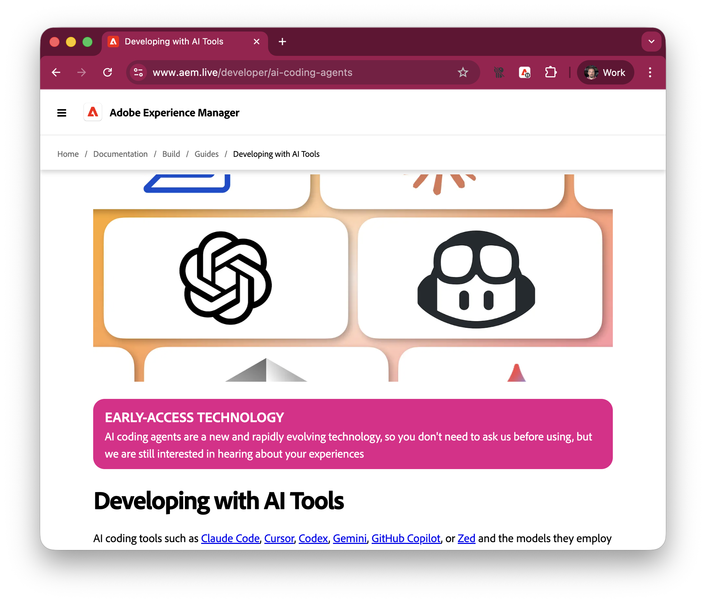
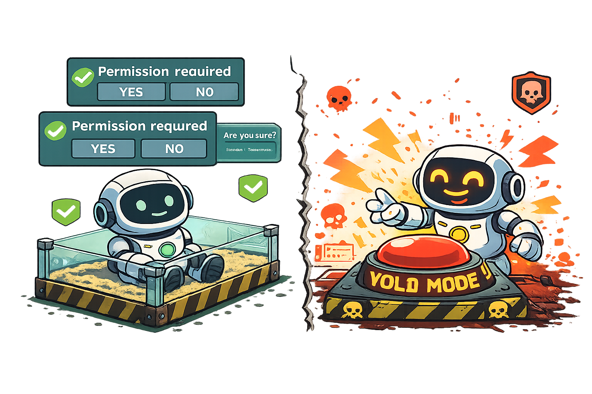
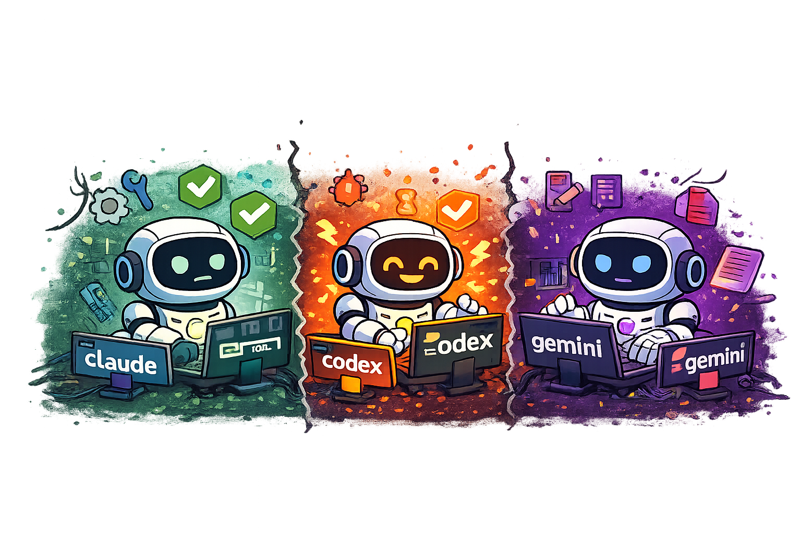
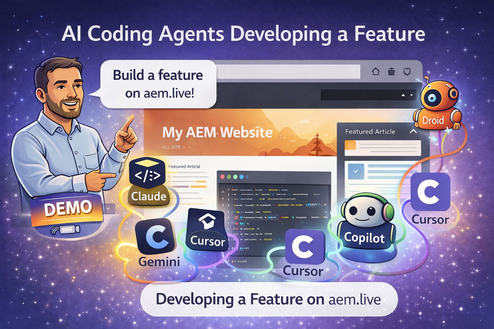
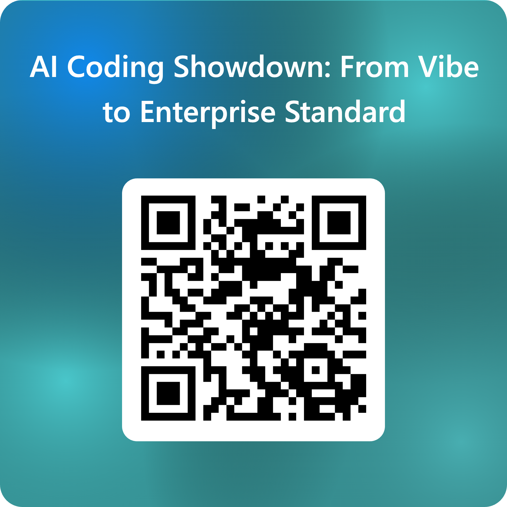

# And AI says hi to you

<!-- column_layout: [2, 1] -->
<!-- column: 0 -->

```bash +exec
./sam --new "Say hi to the Noida Developers Day Live audience"
```

<!-- column: 1 -->


---
# Not just any kind of AI

```banner +animate:rainbow +loop
Agentic
```
---

# What

- Smarter autocomplete
- Chat with your code base, ask questions
- Agents in your IDE
- __Standalone agents in your CLI__ (we are here)
- Standalone agents in the cloud

---

```ascii
┌──────────────────────────────────────────────────────────┐
│                        CLOUD                             │
│                  ┌──────────────────┐                    │
│                  │   Claude Model   │                    │
│                  │   (Sonnet 4.5)   │                    │
│                  └────────▲─────────┘                    │
└───────────────────────────┼──────────────────────────────┘
                            │ API calls
┌───────────────────────────┼──────────────────────────────┐
│                  LOCAL ENVIRONMENT                       │
│                  ┌────────▼─────────┐                    │
│                  │  Agent Harness   │                    │
│                  │ (orchestration)  │                    │
│                  └────────┬─────────┘                    │
│         ┌─────────────────┼─────────────────┐            │
│         │                 │                 │            │
│    ┌────▼─────┐     ┌─────▼─────┐      ┌────▼─────┐      │
│    │ File I/O │     │   Bash    │      │   MCP    │      │
│    │  Tools   │     │   Tools   │      │ Servers  │      │
│    └────┬─────┘     └─────┬─────┘      └────┬─────┘      │
│         └─────────────────┼─────────────────┘            │
│                   ┌───────▼─────────┐                    │
│                   │  Your Codebase  │                    │
│                   │  & Environment  │                    │
│                   └─────────────────┘                    │
└──────────────────────────────────────────────────────────┘
```

---

# Standards & Configuration

```banner +animate:rainbow +loop
STANDARDS
```

---

# Standards & Configuration

- **MCP** - Model Context Protocol for extending agent capabilities
- **AGENTS.md** - Project-specific agent instructions
- **AgentSkills** - On-demand skill modules

These standards help agents understand your codebase and workflows



---
# MCP

```banner +animate:matrix +loop
MCP
```
---

```bash +exec
./sam "Remind me what MCP stands for"
```

---

# AGENTS.md

```banner +animate:matrix +loop
AGENTS.md
```

---

```ascii +animate:typewriter +once
┌────────────────────┐          ┌────────────────────┐
│                    │          │                    │
│    ~/AGENTS.md     │          │    ./AGENTS.md     │
│~/.claude/CLAUDE.md │          │    ./CLAUDE.md     │
│                    │          │                    │
└────────────────────┘          └────────────────────┘
           │                               │
           │                               │
           └────injected into (almost) ────┘
                     every  prompt
                          │
                          ▼
                     ┌─────────┐
                     │ Coding  │
                     │  Agent  │
                     └─────────┘
```

---

```bash +exec
./sam "why should we use Agents.md while working with coding agents, answer in bullet points ?"
```

---

# AgentSkills

```banner +animate:matrix +loop
AgentSkills
```

---

```ascii +animate:matrix
         ┌────────────────────────────────────┐
     ┌───│  .claude/skills/search/SKILLS.md   │
     │   └────────────────────────────────────┘
     │       ┌────────────────────────────────────┐
     ├───────│   .claude/skills/test/SKILLS.md    │
     │       └────────────────────────────────────┘
     │           ┌────────────────────────────────────┐
     ├───────────│    .claude/skills/pr/SKILLS.md     │
     │           └────────────────────────────────────┘
     │
     ▼
┌─────────┐
│ Coding  │ list skills at start of
│  Agent  │ session, load on demand
└─────────┘
```

---

# What skills can do

- make your agent more __skilled__
- are used on-demand
- don't consume *context* by default
- turn multi-step tasks into consistent workflows

<!--

Note: context is the hard currency of coding agents. you want to preserve them,
protect them, and use them wisely.

-->
---

```bash +exec
./sam "Which coding agents currently support AgentSkills"
```

---


# Real-World Example: AEM

```banner +animate:matrix +loop
AEM STANDARDS
```

---

# AEM Standards in Practice

- **AGENTS.md** - Project-specific guidance for AEM Edge Delivery Services
- **Skills** - Orchestration, functional, and research skills for AEM development
- **MCP Servers** - Context7, Helix MCP, Playwright for AEM workflows

**Resources:**
- 📄 [AGENTS.md](https://github.com/adobe/helix-website/blob/main/AGENTS.md)
- 🎯 [Skills](https://github.com/adobe/helix-website/tree/main/.claude/skills)
- 🌐 [aem.live/developer/ai-coding-agents](https://www.aem.live/developer/ai-coding-agents)



---


# Advanced Tools & Techniques

```banner +animate:matrix +loop
POWER USER
```

---

# Advanced Tools & Techniques

- **`--dangerously-skip-permissions`** - Skip safety prompts (YOLO mode)
- **Multitasking** - Run multiple agents in parallel
- **Git Worktrees** - Isolated workspaces for parallel development

Unlock the full potential of coding agents

---

# `--dangerously-skip-permissions`

```banner +animate:matrix +loop
YOLO
```

---

```ascii +animate:fire +loop
  /\/\/\/\/\/\/\/\/\/\/\/\/\/\/\/\/\/\/\/\/\/\/\/\/\/\/\/\/\/\/\
  ////////////////////////// DANGER ZONE ////////////////////////
  /\/\/\/\/\/\/\/\/\/\/\/\/\/\/\/\/\/\/\/\/\/\/\/\/\/\/\/\/\/\/\
                                /\
                               /!!\
                              /!!!!\
                             /!!!!!!\
                            /!!!!!!!!\
                            \!!!!!!!!/
                             \!!!!!!/
                              \!!!!/
                               \!!/
                                \/
  /\/\/\/\/\/\/\/\/\/\/\/\/\/\/\/\/\/\/\/\/\/\/\/\/\/\/\/\/\/\/\
  ///////////////////////////////////////////////////////////////
```

Skips all permission prompts for file operations (and this is where the _fun_ begins)

---
## Normal operations

The agent will ask for permission for any potentially sensitive, or destructive operation.

## How you will feel

Assured, and bored.

## Escape the sandbox




---

# Multitasking/Multi-Clauding

```banner:ogre +animate:fire +loop
PARALLEL
```

---

```ascii +animate:matrix
┌─────────────────┐  ┌─────────────────┐  ┌─────────────────┐
│   Terminal 1    │  │   Terminal 2    │  │   Terminal 3    │
│                 │  │                 │  │                 │
│  $ claude       │  │  $ codex        │  │  $ gemini       │
│  Building...    │  │  Testing...     │  │  Documenting... │
│                 │  │                 │  │                 │
│  [████░░] 60%   │  │  ✓ 47 passed    │  │  Writing API    │
│                 │  │  ⚠ 2 warnings   │  │  docs...        │
└─────────────────┘  └─────────────────┘  └─────────────────┘
         │                    │                    │
         └────────────────────┼────────────────────┘
                              │
                    ┌─────────▼──────────┐
                    │   Same Codebase    │
                    │  Different Tasks   │
                    └────────────────────┘
```

---

# Why run multiple agents?

- **Different tasks in parallel**: Build, test, document simultaneously
- **Different branches**: Work on features while fixes run in main
- **Context isolation**: Each instance focuses on one specific task
- **Faster iteration**: Don't wait for one task to finish before starting another





---

# Git Worktrees

```banner:small +animate:matrix +loop
WORKTREE
```
---


---

```ascii +animate:matrix
                    main repo (.git)
                          │
            ┌─────────────┼─────────────┐
            │             │             │
         claude-1      codex-2        gemini-3
         (main)        (feature-a)   (feature-b)
            │             │             │
         ┌──▼──┐       ┌──▼──┐       ┌──▼──┐
         │ 📁  │       │ 📁  │       │ 📁  │
         │ src │       │ src │       │ src │
         └─────┘       └─────┘       └─────┘
           │             │             │
        claude         codex        gemini
       instance 1    instance 2    instance 3
```

---

# What are Git Worktrees?

Multiple working directories attached to the same repository
- Each worktree can check out a different branch
- Share the same `.git` database (efficient!)
- Work on multiple features/branches simultaneously

# Why They're Perfect for Agents

- Run multiple agents on different branches
- No context switching or stashing required
- Agents can work in parallel without conflicts
- Test features independently while keeping main clean

# Automatic Worktree Detection in **AEM**

`aem up` automatically detects when it's launched in a Git worktree and will pick a non-conflicting port: run as many dev servers as you have worktrees.

---

# Guardrails/Attribution/Transparency

```banner +animate:breathe +loop
SAFETY
```
---

# Guardrails/Attribution/Transparency

```ascii +animate:matrix
┌────────────────────────────────────────┐
│                                        │
│                 GitHub                 │
│                                        │
└─────────▲─────────────────────▲────────┘
          │                     │
┌─────────┴───────┐    ┌────────┴────────┐
│    ┏━━━━━━━━┓   │    │    ┏━━━━━━━┓    │
│    ┃        ┃   │    │    ┃       ┃    │
│    ┃   gh   ┃   │    │    ┃  git  ┃    │
│    ┃        ┃   │    │    ┃       ┃    │
│    ┗━━━━━━━━┛   │    │    ┗━━━━━━━┛    │
│  ai-aligned-gh  │    │ ai-aligned-git  │
└─────────────────┘    └─────────────────┘
         ▲                      ▲
         │                      │
         │     ┌─────────┐      │
         │     │ Coding  │      │
         └─────│  Agent  │──────┘
               └─────────┘
```

---

## Guardrails/Attribution/Transparency

When making changes on github.com (commits, comments, pull requests), attribute them to AI.

This helps reviewers not waste their "Herzblut" on your vibe-coded output.

- https://github.com/trieloff/ai-aligned-gh
- https://github.com/trieloff/ai-aligned-git


---

## Coding Agents: Strengths & Limits

<!-- column_layout: [1, 1] -->
<!-- column: 0 -->

### ✅ Where They Excel

<!-- incremental_lists: false -->

- **Source code** - Natural playground
- **CLI commands** - Fluent & reliable
- **CLI background tasks** - Emerging (Claude leads)

<!-- column: 1 -->

### ⚠️ Where They Struggle

<!-- incremental_lists: false -->

- **Text UIs (TUI)** - Early days, buggy
- **Image inputs** - Eats context space
- **GUI Apps** - Not supported (yet)

<!-- reset_layout -->

---

```banner:epic +animate:matrix
DEMO TIME
```



---

```bash +exec
./sam "Finally What's the key takeaway for developers to successfully building with AI coding agents ?"
```
---
```banner +animate:matrix +loop
THANK YOU
```

<!-- alignment: center -->
```ascii
                                            ╔════════════════════╗
                                            ║   AI ENGINEER      ║
                                    ╔══════╩════════════════════╩═══════╗
                                    ║          ▓▓▓▓▓▓▓▓▓▓▓▓▓▓           ║
                                    ║         ▓▓  ◉       ◉   ▓▓        ║
                                    ║        ▓▓      ▄▄▄▄      ▓▓       ║
                                    ║        ▓▓  ───┘    └───  ▓▓       ║
                                    ║         ▓▓  ▓▓▓▓▓▓▓▓▓▓  ▓▓        ║
                                    ║            ▓▓▓▓▓▓▓▓▓▓▓▓           ║
                      ╔═════════════╩═══════════════════════════════════╩══════════════╗
                      ║                                                                ║
                      ║                   🙏  T H A N K   Y O U  🙏                    ║
                      ║                                                                ║
                      ║                For your time and attention today               ║
                      ║                                                                ║
                      ║                     Questions? Let's talk 🚀                   ║
                      ║                                                                ║
                      ║                          Neeraj Garg                           ║
                      ║                       Sam (AI Copresenter)                     ║
                      ║                                                                ║
                      ╚════════════════════════════════════════════════════════════════╝
```
---



---

